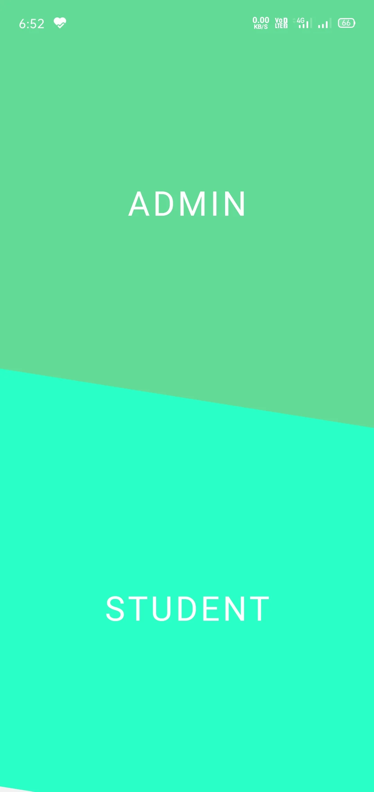
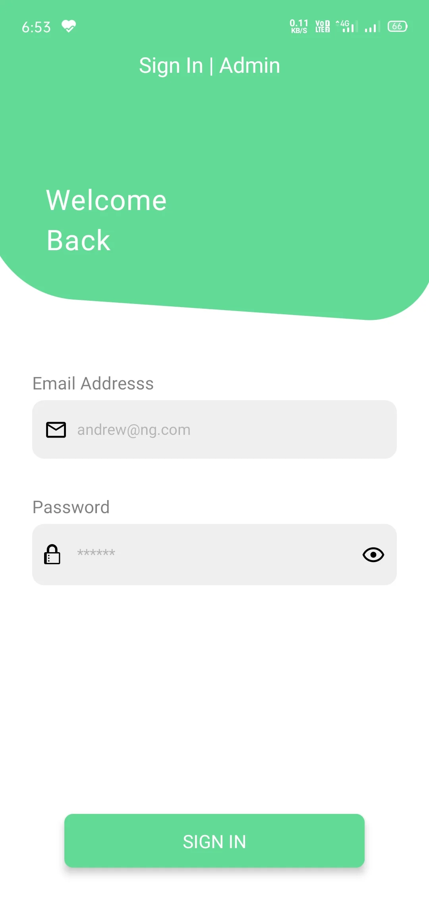
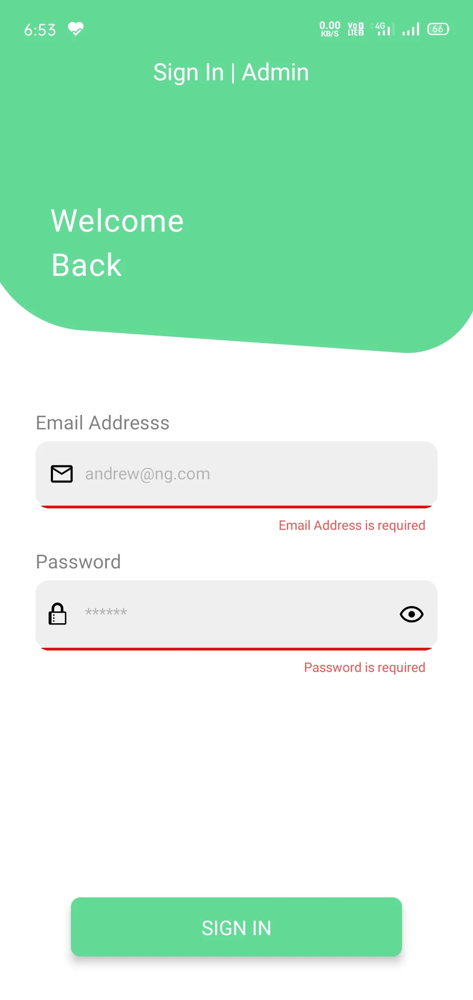
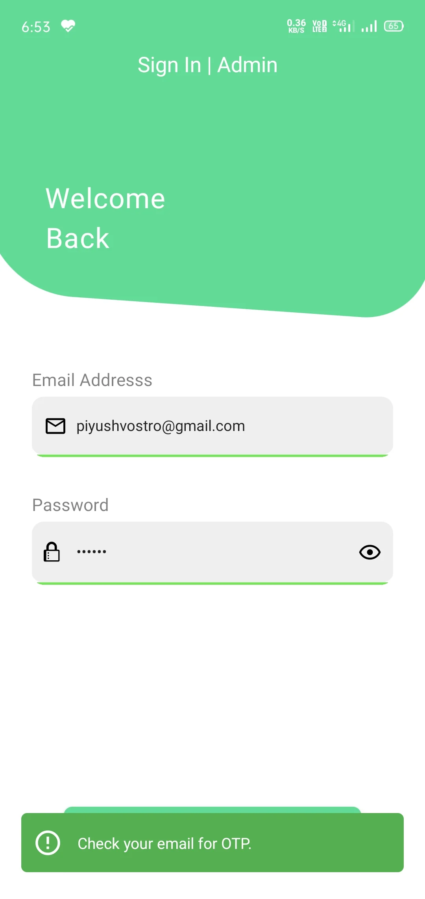
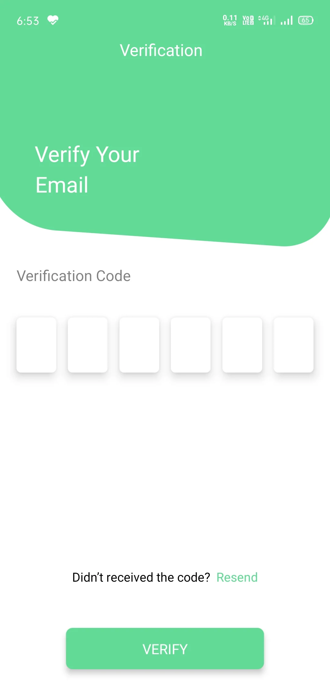
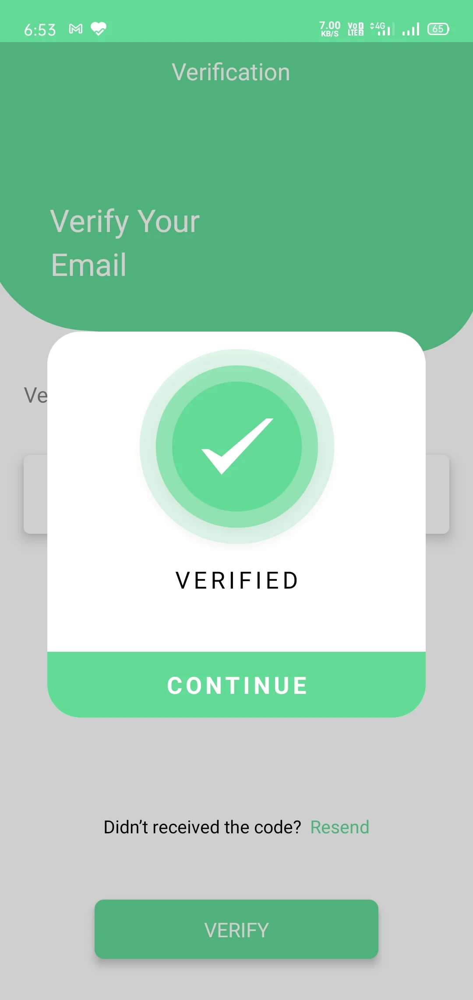

<h1 align="center">

</h1>
<h1 align="center" style='letter-spacing:3px;margin:0;margin-bottom:2vh'>
	hostals
</h1>
<p align="center">
	
	
</p>

# Overview

<h5 style='font-weight:400'>
This mobile app is built using react native framework to facilitate Hostel Room Management Services.
</h5>

# Screenshots


### Authentication






<!-- 
## Installation and usage

Be sure, you have installed all dependencies and applications to run React Native project on your computer : [Getting Started with React Native](https://facebook.github.io/react-native/docs/getting-started).

This project works fine for iOS but in Android version there are serious UI problems because I've only worked on iOS.


### Running the project

Clone this repository :

```
git clone https://github.com/stevenpersia/tinder-react-native.git
cd tinder-react-native
```

Install packages :

```
npm install
```

When installation is complete, run with version of your choice :

```bash
react-native run-ios
# or
react-native run-android
```


## Props

### CardItem

| Name           | Type     | Required | Description                                               | Example                                             |
| -------------- | -------- | -------- | --------------------------------------------------------- | --------------------------------------------------- |
| `image`        | string   | Yes      | Picture of member.                                        | `image="https://..."`                               |
| `name`         | string   | Yes      | Name of member.                                           | `name="John Doe"`                                   |
| `description`  | string   | Yes      | Description of member.                                    | `description="Full-time Traveller. Globe Trotter."` |
| `matches`      | string   | Yes      | Match percentage.                                         | `matches="95"`                                      |
| `actions`      | boolean  | No       | Display actions buttons (Like, Dislike, ...).             | `actions`                                           |
| `onPressLeft`  | function | No       | Swipe card to left.                                       | `onPressLeft={() => this.swiper.swipeLeft()}`       |
| `onPressRight` | function | No       | Swipe card to right.                                      | `onPressRight={() => this.swiper.swipeRight()}`     |
| `status`       | string   | No       | Display online or offline badge (`Online` and `Offline`). | `status="Online"`                                   |
| `variant`      | boolean  | No       | Display another style of card (used for Matches screen).  | `variant`                                           |

### Message

| Name          | Type   | Required | Description             | Example                                                                                      |
| ------------- | ------ | -------- | ----------------------- | -------------------------------------------------------------------------------------------- |
| `image`       | string | Yes      | Picture of member.      | `image="https://..."`                                                                        |
| `name`        | string | Yes      | Name of member.         | `name="John Doe"`                                                                            |
| `lastMessage` | string | Yes      | Last message of member. | `lastMessage="You want order in Gotham. Batman must take off his mask and turn himself in."` |


### ProfileItem

| Name       | Type   | Required | Description                 | Example                                    |
| ---------- | ------ | -------- | --------------------------- | ------------------------------------------ |
| `name`     | string | Yes      | Name of member.             | `name="John Doe"`                          |
| `matches`  | string | Yes      | Match percentage.           | `matches="95"`                             |
| `age`      | string | No       | Age of member.              | `age="25"`                                 |
| `location` | string | No       | Location of member.         | `location="Paris, France"`                 |
| `info1`    | string | No       | More information of member. | `info1="Straight, Single"`                 |
| `info2`    | string | No       | More information of member. | `info2="Tea Totaller & Loves Photography"` |
| `info3`    | string | No       | More information of member. | `info3="Beaches, Mountain & Coffee"`       |
| `info4`    | string | No       | More information of member. | `info4="Last seen: 23h ago"`               |


## Star, Fork, Clone & Contribute

Feel free to contribute on this repository. If my work helps you, please give me back with a star. This means a lot to me and keeps me going!

## Contributors

<!-- ALL-CONTRIBUTORS-LIST:START - Do not remove or modify this section -->
<!-- prettier-ignore -->
<!-- <table>
  <tr>
<td align="center"><a href="http://Skibudsapp.com"><br /><sub><b>Stephen Phillips</b></sub></a><br /><a href="#question-Sbphillips19" title="Answering Questions">💬</a></td>
<td align="center"><a href="https://github.com/anand9"><br /><sub><b>Anand Vasudevan </b></sub></a><br /><a href="https://github.com/stevenpersia/tinder-react-native/commits?author=anand9" title="Code">💻</a></td>
  </tr>
</table> -->

<!-- ALL-CONTRIBUTORS-LIST:END -->
